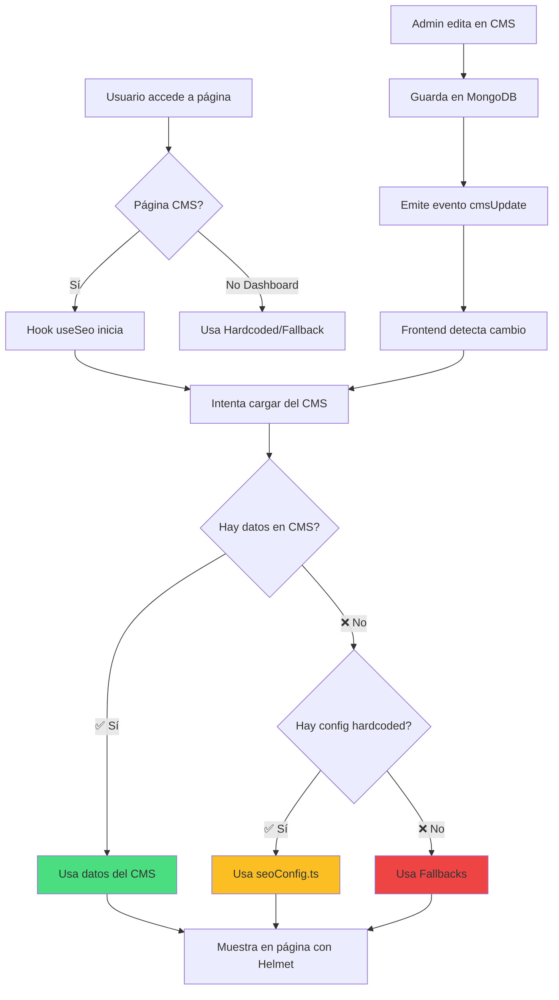

# 🎯 Solución de SEO Independiente por Página

## 📋 Resumen del Problema

Las páginas **Blog**, **Nosotros** y **Servicios** tenían metadatos SEO duplicados o hardcodeados, lo que impactaba negativamente en el posicionamiento de búsqueda. Cada página necesita tener metadatos únicos y relevantes.

## ✅ Solución Implementada - Sistema de Prioridad Triple

### 🔝 Sistema de Prioridad (De Mayor a Menor)

```
┌──────────────────────────────────────────────┐
│  1️⃣ CMS DATABASE (MongoDB)                   │
│     ✅ Prioridad MÁXIMA                       │
│     📝 Editable desde panel CMS              │
│     🔄 Actualización en tiempo real          │
└──────────────────────────────────────────────┘
                    ↓ Si no existe
┌──────────────────────────────────────────────┐
│  2️⃣ CONFIGURACIÓN HARDCODEADA                │
│     ⚙️ Archivo: seoConfig.ts                 │
│     🎯 SEO profesional por defecto           │
│     🔍 Fácil identificación de problemas     │
└──────────────────────────────────────────────┘
                    ↓ Si no existe
┌──────────────────────────────────────────────┐
│  3️⃣ FALLBACKS GENÉRICOS                      │
│     🆘 Último recurso                         │
│     📌 Valores básicos de la aplicación      │
└──────────────────────────────────────────────┘
```

### 🎯 Ventajas del Sistema de Prioridad

1. **✅ Transparencia Total**: Logs indican exactamente de dónde vienen los datos
2. **✅ SEO Profesional por Defecto**: Cada página tiene metadatos optimizados hardcodeados
3. **✅ Editable desde CMS**: El panel CMS tiene prioridad sobre todo
4. **✅ Identificación Rápida**: Sabes inmediatamente si hay problemas con el CMS
5. **✅ Sin Downtime**: Si el CMS falla, la página sigue con SEO hardcodeado

### 📂 Archivos de Configuración

#### 1. **Configuración Hardcodeada** (`frontend/src/config/seoConfig.ts`)

Este archivo contiene metadatos SEO optimizados para cada página:

```typescript
// Ejemplo: Configuración para Blog
blog: {
  metaTitle: 'Blog SCUTI Company - Noticias y Tendencias Tecnológicas',
  metaDescription: 'Mantente informado con las últimas noticias...',
  keywords: ['blog tecnologia', 'noticias tech', 'desarrollo web'],
  ogTitle: 'Blog SCUTI - Innovación y Tecnología',
  ogDescription: 'Lee las últimas noticias del mundo tecnológico',
  ogImage: 'https://scuticompany.com/images/blog-og.jpg',
  twitterCard: 'summary_large_image'
}
```

**Páginas configuradas:**
- ✅ `blog` - Blog de noticias
- ✅ `services` / `servicios` - Servicios
- ✅ `about` / `nosotros` - Nosotros
- ✅ `contact` / `contacto` - Contacto

**⚠️ NOTA:** La página `home` NO está aquí porque tiene su propio sistema de SEO que funciona perfectamente. Ver [HOME_SEO_SYSTEM.md](HOME_SEO_SYSTEM.md)

#### 2. **Hook useSeo** (`frontend/src/hooks/useSeo.tsx`)

Gestiona la carga y prioridad de metadatos:

```typescript
const { SeoHelmet } = useSeo({
  pageName: 'blog',  // Identificador de la página
  fallbackTitle: 'Blog SCUTI',  // Usado solo si no hay CMS ni hardcoded
  fallbackDescription: 'Blog de tecnología'
});
```

### 🔍 Logging y Transparencia

En **modo desarrollo**, el hook muestra logs claros sobre el origen de los datos:

```javascript
// ✅ Datos del CMS
✅ [useSeo] "blog" - Origen: CMS (Database)
   Title: Blog SCUTI Company - Noticias Tecnológicas
   Description: Mantente informado con las últimas noticias...

// ⚙️ Configuración hardcodeada
⚙️ [useSeo] "blog" - Origen: HARDCODED (seoConfig.ts)
   Razón: CMS no disponible o sin datos

// ⚠️ Fallback genérico
⚠️ [useSeo] "blog" - Origen: FALLBACK
   Razón: Sin CMS ni configuración hardcodeada
```

### 1. **Frontend - Hook Unificado `useSeo()`**

**Archivo**: `frontend/src/hooks/useSeo.tsx`

El hook `useSeo()` ahora gestiona dinámicamente los metadatos SEO con sistema de prioridad triple:

```typescript
const { SeoHelmet } = useSeo({
  pageName: 'blog',  // Identificador único de la página
  fallbackTitle: 'Blog SCUTI Company',  // Usado solo como último recurso
  fallbackDescription: 'Contenido curado de tecnología...'
});
```

**Sistema de carga:**
1. **Intenta cargar del CMS** (MongoDB) → Si existe, lo usa ✅
2. **Si no hay en CMS**, usa configuración hardcodeada (seoConfig.ts) ⚙️
3. **Si no hay hardcoded**, usa fallbacks genéricos ⚠️

**Páginas soportadas**:
- ✅ `about` / `nosotros` - Página Nosotros
- ✅ `services` / `servicios` - Página Servicios
- ✅ `contact` / `contacto` - Página Contacto
- ✅ `blog` - Página Blog

**⚠️ EXCEPCIÓN:** `home` tiene su propio sistema (ver [HOME_SEO_SYSTEM.md](HOME_SEO_SYSTEM.md))

### 2. **Cambios en BlogHome.tsx**

**Antes** (❌ Hardcodeado sin flexibilidad):
```tsx
<Helmet>
  <title>Blog SCUTI Company - Noticias...</title>
  <meta name="description" content="Mantente informado..." />
  {/* 40+ líneas de metadatos hardcodeados */}
</Helmet>
```

**Después** (✅ Sistema de prioridad triple):
```tsx
const { SeoHelmet } = useSeo({
  pageName: 'blog',
  fallbackTitle: 'Blog SCUTI Company - Noticias Tecnológicas',
  fallbackDescription: 'Contenido curado de tecnología...'
});

return (
  <div>
    <SeoHelmet />  {/* Usa: CMS > Hardcoded > Fallback */}
    {/* Resto del contenido */}
  </div>
);
```

### 3. **Nueva Configuración Hardcodeada**

**Archivo**: `frontend/src/config/seoConfig.ts`

Configuración SEO profesional por defecto para todas las páginas:

```typescript
export const DEFAULT_SEO_CONFIG = {
  blog: {
    metaTitle: 'Blog SCUTI Company - Noticias y Tendencias Tecnológicas',
    metaDescription: 'Mantente informado con las últimas noticias...',
    keywords: ['blog tecnologia', 'noticias tech', 'desarrollo web'],
    ogTitle: 'Blog SCUTI - Innovación y Tecnología',
    ogImage: 'https://scuticompany.com/images/blog-og.jpg'
  },
  services: { /* ... */ },
  about: { /* ... */ },
  // ... más páginas
};
```

### 4. **Backend - Modelo de Datos SEO**

**Archivo**: `backend/models/Page.js`

El modelo `Page` incluye un esquema completo para SEO que tiene **PRIORIDAD MÁXIMA**:

```javascript
seo: {
  metaTitle: { type: String, default: '' },
  metaDescription: { type: String, default: '' },
  keywords: { type: [String], default: [] },
  ogTitle: { type: String, default: '' },
  ogDescription: { type: String, default: '' },
  ogImage: { type: String, default: '' },
  twitterCard: { type: String, default: 'summary_large_image' }
}
```

**✅ Cuando guardas datos en el CMS:**
- Se almacenan en MongoDB
- Tienen prioridad sobre la configuración hardcodeada
- Se actualizan en tiempo real en el frontend

**⚙️ Si no hay datos en el CMS:**
- Se usa la configuración de `seoConfig.ts`
- Asegura que siempre haya SEO profesional

## 🔧 Cómo Configurar SEO Independiente

### 🎯 Escenario 1: Editar desde Panel CMS (Recomendado)

**Esta es la forma RECOMENDADA** porque los datos del CMS tienen prioridad máxima.

1. **Acceder al CMS Manager** → `/cms-manager`
2. **Seleccionar la página** a editar (Blog, Servicios, Nosotros)
3. **Ir a la sección SEO**
4. **Configurar los siguientes campos**:

   - **Meta Title**: Título que aparecerá en Google (50-60 caracteres)
   - **Meta Description**: Descripción breve (150-160 caracteres)
   - **Keywords**: Lista de palabras clave separadas por comas
   - **OG Title**: Título para redes sociales (Facebook, LinkedIn)
   - **OG Description**: Descripción para redes sociales
   - **OG Image**: URL de imagen destacada (1200x630px recomendado)

5. **Guardar cambios**

### 🎯 Escenario 2: Modificar Configuración Hardcodeada

**Editar**: `frontend/src/config/seoConfig.ts`

Esta configuración se usa cuando **NO hay datos en el CMS**. Es útil para:
- Definir SEO por defecto profesional
- Testing sin acceso al CMS
- Recuperación ante fallos del CMS

```typescript
// Ejemplo: Personalizar SEO hardcodeado para Blog
export const DEFAULT_SEO_CONFIG: SeoConfigMap = {
  blog: {
    metaTitle: 'Tu Nuevo Título para Blog',
    metaDescription: 'Tu nueva descripción optimizada',
    keywords: ['palabra1', 'palabra2', 'palabra3'],
    ogTitle: 'Título para redes sociales',
    ogDescription: 'Descripción para compartir',
    ogImage: 'https://tu-dominio.com/imagen.jpg',
    twitterCard: 'summary_large_image'
  },
  // ... otras páginas
};
```

**⚠️ IMPORTANTE:**
- Estos valores se usan **solo si no hay datos en el CMS**
- El CMS siempre tiene prioridad
- Útil para tener defaults profesionales

### 🎯 Escenario 3: Editar vía API

**Endpoint**: `PUT /api/cms/pages/:pageSlug`

Los datos guardados vía API tienen **PRIORIDAD MÁXIMA** (igual que desde el CMS):

```javascript
// Ejemplo: Actualizar SEO de la página Blog vía API
fetch('https://api.scuticompany.com/api/cms/pages/blog', {
  method: 'PUT',
  headers: {
    'Content-Type': 'application/json',
    'Authorization': 'Bearer YOUR_TOKEN'
  },
  body: JSON.stringify({
    seo: {
      metaTitle: 'Blog SCUTI Company - Innovación y Tecnología en Perú',
      metaDescription: 'Descubre las últimas tendencias en desarrollo...',
      keywords: ['blog tecnología', 'desarrollo software', 'IA Peru'],
      ogTitle: 'Blog SCUTI - Noticias de Tecnología',
      ogDescription: 'Las últimas noticias y análisis del sector tecnológico',
      ogImage: 'https://cdn.scuticompany.com/images/blog-og.jpg'
    }
  })
});
```

**✅ Resultado**: Estos datos se guardan en MongoDB y tienen prioridad sobre todo lo demás.

### 🎯 Escenario 4: Editar Directamente en MongoDB

```javascript
// Conectar a MongoDB y actualizar
db.pages.updateOne(
  { pageSlug: 'blog' },
  {
    $set: {
      'seo.metaTitle': 'Blog SCUTI Company - Tu título aquí',
      'seo.metaDescription': 'Tu descripción aquí',
      'seo.keywords': ['palabra1', 'palabra2', 'palabra3'],
      'seo.ogTitle': 'Título para redes sociales',
      'seo.ogDescription': 'Descripción para redes sociales',
      'seo.ogImage': 'https://tu-imagen.jpg'
    }
  }
);
```

## 📊 Configuración Recomendada por Página

**⚠️ NOTA:** La página Home NO está incluida aquí porque tiene su propio sistema de SEO. Ver [HOME_SEO_SYSTEM.md](HOME_SEO_SYSTEM.md)

### 📰 Página BLOG

```javascript
{
  metaTitle: "Blog SCUTI - Tendencias en Tecnología y Desarrollo",
  metaDescription: "Noticias, tutoriales y análisis sobre desarrollo web, IA, cloud computing y las últimas tendencias tecnológicas. Contenido experto para profesionales tech.",
  keywords: ["blog tecnologia", "noticias tech", "desarrollo web", "inteligencia artificial", "cloud computing", "tutoriales programacion"],
  ogTitle: "Blog SCUTI - Innovación y Tecnología",
  ogDescription: "Lee las últimas noticias del mundo tech",
  ogImage: "https://scuticompany.com/images/blog-og.jpg"
}
```

### 💼 Página SERVICIOS

```javascript
{
  metaTitle: "Servicios de Desarrollo Software - SCUTI Company",
  metaDescription: "Desarrollo de aplicaciones web y móviles, soluciones de IA, cloud computing, consultoría tecnológica y más. Servicios profesionales para empresas en crecimiento.",
  keywords: ["servicios desarrollo software", "aplicaciones web", "desarrollo movil", "consultoria tecnologica", "soluciones ia"],
  ogTitle: "Nuestros Servicios - SCUTI Company",
  ogDescription: "Servicios tecnológicos profesionales para tu empresa",
  ogImage: "https://scuticompany.com/images/services-og.jpg"
}
```

### 👥 Página NOSOTROS

```javascript
{
  metaTitle: "Sobre Nosotros - SCUTI Company | Quiénes Somos",
  metaDescription: "Conoce a SCUTI Company: equipo de expertos en tecnología con más de X años de experiencia. Nuestra misión es transformar negocios mediante soluciones innovadoras.",
  keywords: ["scuti company", "empresa tecnologia peru", "equipo desarrollo", "nosotros scuti", "vision mision"],
  ogTitle: "Sobre SCUTI Company - Nuestro Equipo",
  ogDescription: "Conoce quiénes somos y qué nos motiva",
  ogImage: "https://scuticompany.com/images/about-og.jpg"
}
```

## 🎯 Mejores Prácticas SEO

### Títulos (Meta Title)
- ✅ **Longitud**: 50-60 caracteres
- ✅ **Incluir**: Marca + Palabra clave principal
- ✅ **Evitar**: Keyword stuffing, caracteres especiales excesivos
- ✅ **Ejemplo**: "Blog SCUTI - Tendencias en Tecnología"

### Descripciones (Meta Description)
- ✅ **Longitud**: 150-160 caracteres
- ✅ **Incluir**: Llamado a la acción, valor único
- ✅ **Evitar**: Duplicados entre páginas
- ✅ **Ejemplo**: "Descubre las últimas tendencias en IA y desarrollo. Contenido experto para profesionales tech."

### Keywords
- ✅ **Cantidad**: 5-10 palabras clave relevantes
- ✅ **Mezclar**: Términos generales y específicos
- ✅ **Ejemplo**: `["desarrollo software", "IA", "cloud peru"]`

### Open Graph (Redes Sociales)
- ✅ **OG Image**: 1200x630px (recomendado por Facebook)
- ✅ **Formato**: JPG o PNG (< 1MB)
- ✅ **Contenido**: Logo + Texto descriptivo

## 🧪 Validación y Testing

### 1. Google Rich Results Test
```
https://search.google.com/test/rich-results
```

### 2. Facebook Sharing Debugger
```
https://developers.facebook.com/tools/debug/
```

### 3. Twitter Card Validator
```
https://cards-dev.twitter.com/validator
```

### 4. Lighthouse (Chrome DevTools)
- Acceder a DevTools → Lighthouse → SEO Audit

## 🔄 Flujo de Actualización



### 📊 Prioridad Visual

```
┌─────────────────────────────────────────┐
│ 🥇 CMS Database (MongoDB)                │  ← Máxima prioridad
│    Editable desde panel CMS             │
│    API: PUT /api/cms/pages/:slug        │
└─────────────────────────────────────────┘
              ↓ Si no existe
┌─────────────────────────────────────────┐
│ 🥈 Configuración Hardcodeada            │  ← Segunda prioridad
│    Archivo: seoConfig.ts                │
│    SEO profesional por defecto          │
└─────────────────────────────────────────┘
              ↓ Si no existe
┌─────────────────────────────────────────┐
│ 🥉 Fallbacks Genéricos                  │  ← Última opción
│    Valores mínimos                      │
└─────────────────────────────────────────┘
```

## 📁 Archivos Modificados/Creados

### Frontend
- ✅ `frontend/src/pages/public/blog/BlogHome.tsx`
  - Reemplazado Helmet hardcodeado por `useSeo()` hook
  
- ✅ `frontend/src/hooks/useSeo.tsx`
  - Agregado `'blog'` a la lista `CMS_PAGES`
  - Implementado sistema de prioridad triple (CMS > Hardcoded > Fallback)
  - Agregado logging transparente en modo desarrollo

- ✅ `frontend/src/config/seoConfig.ts` **(NUEVO)**
  - Configuración SEO hardcodeada para todas las páginas
  - Metadatos profesionales por defecto
  - Usado cuando no hay datos en el CMS

### Backend
- ✅ `backend/models/Page.js`
  - Ya incluía esquema SEO completo
  - Soporta `pageSlug: 'blog'`
  - Los datos guardados tienen prioridad máxima

### Documentación
- ✅ `backend/docs/SOLUCION_SEO_INDEPENDIENTE.md`
  - Documentación completa del sistema
  - Guías de uso y configuración
  - Ejemplos de implementación

## ✨ Beneficios del Sistema

1. **✅ SEO Independiente por Página**: Cada página tiene metadatos únicos
2. **✅ Sistema de Prioridad Transparente**: CMS > Hardcoded > Fallback
3. **✅ Sin Downtime**: Si el CMS falla, usa configuración hardcodeada profesional
4. **✅ Fácil Debugging**: Logs claros indican el origen de los datos (DEV mode)
5. **✅ Gestión Centralizada**: Todo desde el panel CMS cuando esté disponible
6. **✅ Defaults Profesionales**: Cada página tiene SEO optimizado hardcodeado
7. **✅ Tiempo Real**: Cambios del CMS visibles inmediatamente sin rebuild
8. **✅ Fallbacks Inteligentes**: Sistema de cascada asegura siempre hay SEO
9. **✅ Escalable**: Fácil agregar nuevas páginas a `seoConfig.ts`
10. **✅ Identificación de Problemas**: Detecta inmediatamente si hay issues con el CMS

## 🚀 Próximos Pasos

### Inmediatos
1. **Verificar logs en desarrollo** - Abrir DevTools y ver de dónde vienen los datos SEO
2. **Revisar configuración hardcodeada** - Verificar que `seoConfig.ts` tiene valores profesionales
3. **Configurar SEO en CMS** - Editar metadatos únicos para cada página desde el panel

### Recomendados
1. **Subir imágenes OG optimizadas** (1200x630px) para cada página
2. **Validar con herramientas**:
   - Google Rich Results Test
   - Facebook Sharing Debugger
   - Twitter Card Validator
3. **Monitorear rankings** en Google Search Console
4. **Iterar basándose en métricas** de rendimiento

### Opcional
1. **Personalizar hardcoded config** si los defaults no te convencen
2. **Agregar más páginas** a `seoConfig.ts` según necesites
3. **Implementar A/B testing** de diferentes títulos/descripciones

## 📞 Soporte

Para más información o problemas:
- **Documentación CMS**: `/backend/docs/CMS_DOCUMENTATION.md`
- **Hook useSeo**: `/frontend/src/hooks/useSeo.tsx`
- **Config SEO**: `/frontend/src/config/seoConfig.ts`
- **Modelo Page**: `/backend/models/Page.js`

## 🐛 Troubleshooting

### ❓ ¿Cómo sé de dónde vienen los datos SEO?

**En modo desarrollo**, abre la consola del navegador:

```javascript
// Verás logs como estos:
✅ [useSeo] "blog" - Origen: CMS (Database)     // ← Datos del CMS
⚙️ [useSeo] "blog" - Origen: HARDCODED         // ← seoConfig.ts
⚠️ [useSeo] "blog" - Origen: FALLBACK          // ← Último recurso
```

### ❓ ¿Por qué no se aplican mis cambios del CMS?

**Verificar:**
1. ¿Los datos se guardaron en MongoDB? → Revisar base de datos
2. ¿El frontend detecta el cambio? → Revisar logs en consola
3. ¿Hay cache del navegador? → Hacer Ctrl+Shift+R (hard refresh)
4. ¿El slug de la página es correcto? → Debe coincidir con `pageName` en el hook

### ❓ ¿Cómo edito la configuración hardcodeada?

Edita el archivo: `frontend/src/config/seoConfig.ts`

```typescript
export const DEFAULT_SEO_CONFIG = {
  blog: {
    metaTitle: 'Tu nuevo título',
    // ... resto de campos
  }
};
```

**Recuerda:** Los datos del CMS siempre tienen prioridad sobre esto.

### ❓ ¿Puedo agregar una nueva página?

**Sí**, sigue estos pasos:

1. **Agregar a seoConfig.ts**:
```typescript
export const DEFAULT_SEO_CONFIG = {
  // ... páginas existentes
  'mi-nueva-pagina': {
    metaTitle: 'Título de mi página',
    metaDescription: 'Descripción...',
    keywords: ['palabra1', 'palabra2'],
    // ... resto
  }
};
```

2. **Agregar a CMS_PAGES en useSeo.tsx**:
```typescript
const CMS_PAGES = ['home', 'about', 'services', 'contact', 'blog', 'mi-nueva-pagina'];
```

3. **Usar el hook en tu componente**:
```typescript
const { SeoHelmet } = useSeo({
  pageName: 'mi-nueva-pagina',
  fallbackTitle: 'Mi Página'
});
```

### ❓ ¿Cómo fuerzo una recarga del CMS?

Desde la consola del navegador:

```javascript
// Limpiar cache y recargar
window.dispatchEvent(new Event('clearCache'));
```

O simplemente recarga la página con Ctrl+Shift+R.

---

**Última actualización**: Diciembre 2025  
**Versión**: 2.0.0 (Sistema de Prioridad Triple)  
**Mantenedor**: Equipo SCUTI Company
